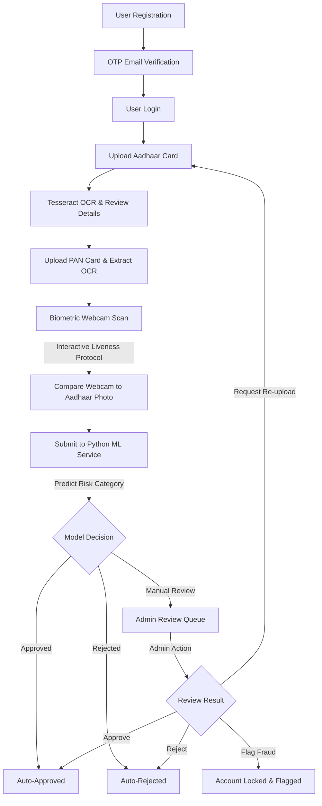

# Veritas eKYC
### Enterprise-Grade AI-Powered Identity Verification & Fraud Detection System

[](https://react.dev/)
[](https://expressjs.com/)
[](https://www.mongodb.com/atlas)
[](https://scikit-learn.org/)
[](https://cloudinary.com/)
[](https://github.com/naptha/tesseract.js)
[](https://github.com/justadudewhohacks/face-api.js)

---

## 1. Project Title
**Veritas eKYC**: A secure, multi-modal, end-to-end identity verification and real-time fraud assessment pipeline built for modern banking and fintech platforms.

---

## 2. Executive Summary
**Veritas eKYC** is a full-stack automated identity verification platform designed to orchestrate secure user onboarding. By combining client-side computer vision (`face-api.js`), local optical character recognition (`Tesseract.js`), cloud media storage (`Cloudinary`), and an ensemble machine learning classifier (`Scikit-Learn` Random Forest), Veritas provides automated, real-time risk evaluations. 

The system guides users through email verification, document uploads, interactive liveness challenges, and face-document similarity matching. Results are processed through a scikit-learn fraud classifier and, if flagged, routed to a dedicated administrative dashboard for human-in-the-loop review. Built with security-first patterns, the application logs every onboarding event to an immutable audit trail and registers client device fingerprints to prevent account takeover and sybil attacks.

---

## 3. Business Problem
Financial institutions lose billions annually to identity fraud, synthetic identities, and bot-driven onboarding flows. Traditional KYC (Know Your Customer) systems suffer from:
*   **High Abandonment Rates:** Friction-heavy processes that take days to complete.
*   **Vulnerability to Spoofing:** Simple selfie uploads are easily bypassed using high-definition photos, screen replays, or printouts.
*   **Manual Overhead:** Compliance teams are overwhelmed by reviewing every single application.
*   **Lack of Traceability:** Poor audit trails make tracking document alterations and compromised devices difficult.

---

## 4. Solution Overview
Veritas mitigates these problems through a secure, self-service digital onboarding experience:
*   **Frictionless Verification:** Automates data entry using server-side document OCR.
*   **Interactive Liveness Checking:** Bypasses presentation attacks (photos, video replays) by enforcing a real-time sequence of random biometric motions (blinking, head turns, smiling).
*   **Hybrid Matching Logic:** Performs zero-server-overhead client-side biometric comparison, then cross-validates data integrity server-side.
*   **Automated Risk Grading:** Evaluates verification confidence and document matches using a Random Forest machine learning model, instantly approving low-risk users.
*   **Human-in-the-Loop Safeguards:** Forwards borderline and high-risk applicants to a protected admin queue, preserving operational oversight.

---

## 5. Core Features
*   **Secure Auth & OTP Verification:** Stateless JWT authentication, Nodemailer-based Gmail SMTP OTP verification, password hashing, and forgot/reset password flows.
*   **Multi-Document OCR Parsing:** Local extraction of name, date of birth, gender, Aadhaar, and PAN numbers using Tesseract.js, paired with custom regex sanitization.
*   **Client-Side Biometric Bi-Verification:** Webcam capture matching real-time face descriptors to Aadhaar card profile photos using `face-api.js` local neural network weights.
*   **Custom Interactive Liveness Protocol:** Real-time feedback verifying genuine user presence through blink, head rotation angles, and happy expression classification.
*   **Scikit-Learn Fraud Assessment:** Python Flask microservice deploying a trained Random Forest model mapping face match confidence, document alignment, liveness checks, and OCR confidence to a final status recommendation.
*   **Access-Controlled Admin Suite:** Restricted administrative back-office offering dashboard analytics, verification throughput stats, fraud classification distribution, and audit log analysis.
*   **Deduplicated Administrative Queue:** MongoDB unique partial index prevents concurrent submission races, ensuring clean queue transitions.
*   **Session Auditing & Device Fingerprinting:** Automatically tracks client IP, user-agent details (browser, OS, device type), geolocations, and log entries (LOGIN, DOCUMENT_UPLOAD, FACE_VERIFICATION, ADMIN_DECISION).

---

## 6. Complete Verification Workflow



---

## 7. System Architecture Diagram (ASCII)

```
+-----------------------------------------------------------------------------------------+
|                                  USER / CLIENT BROWSER                                  |
|                                                                                         |
|   +--------------------------+   +------------------------+   +---------------------+   |
|   |   React Client (Vite)    |-->| face-api.js (Local JS) |-->|   react-webcam      |   |
|   |  Interactive UI, Forms   |   | Liveness, Biometrics   |   |   Selfie Capture    |   |
|   +--------------------------+   +------------------------+   +---------------------+   |
+-----------------------------------------------|-----------------------------------------+
                                                | HTTP REST API Calls
                                                v
+-----------------------------------------------------------------------------------------+
|                                EXPRESS APPLICATION SERVER                               |
|                                                                                         |
|   +-----------------------+     +------------------------+     +--------------------+   |
|   |    Auth Middleware    |     |  Tesseract.js Engine   |     | Nodemailer (SMTP)  |   |
|   |  JWT Validation, Role |     |  OCR Data Extraction   |     | OTP Email Services |   |
|   +-----------------------+     +------------------------+     +--------------------+   |
|               |                             |                             |             |
|               v                             v                             v             |
|   +---------------------------------------------------------------------------------+   |
|   |                                  Controllers                                    |   |
|   | (Auth, Uploads, OCR, Verification, Admin Queue, Analytics, Dashboard)           |   |
|   +---------------------------------------------------------------------------------+   |
+------------------------|-------------------------|--------------------------|-----------+
                         |                         |                          |
       Mongoose Dialect  |                         | Multer File Streams      | Axios POST
                         v                         v                          v
+----------------------------------+     +-------------------+     +----------------------+
|             DATABASE             |     |   MEDIA HOSTING   |     |    PYTHON ML APPS    |
|                                  |     |                   |     |                      |
|       MongoDB Atlas Cloud        |     |  Cloudinary API   |     | Flask / Scikit-Learn |
|  User, Admin, Queue, AuditLog    |     | Aadhaar, PAN,     |     | Random Forest Model  |
|         collections              |     | Web Biometrics    |     | (Port: 5001)         |
+----------------------------------+     +-------------------+     +----------------------+
```

---

## 8. Tech Stack

| Component | Technology | Rationale / Use Case |
| :--- | :--- | :--- |
| **Frontend Core** | React 18.2, Vite | High-performance client build, reactive state rendering. |
| **Animation UI** | Framer Motion, GSAP, Lenis | Micro-interactions, timeline visual steps, premium aesthetics. |
| **Client Vision** | face-api.js | Neural networks (TinyYolov2, ResNet) running locally to save server compute. |
| **Biometric Input**| react-webcam | Captures stable webcam frame streams for liveness validation. |
| **Backend Framework**| Express 5.2 (Node.js) | Non-blocking API routing, middleware chaining, JSON parsing. |
| **OCR Engine** | Tesseract.js 7.0 | Server-side OCR reading Aadhaar/PAN image buffers directly. |
| **Email SMTP** | Nodemailer 9.0 | Delivers transactional OTP and verification link emails. |
| **Storage Engine** | Multer & Cloudinary v2 | Managed multipart file pipelines hosting document and selfie assets. |
| **Database** | MongoDB Atlas / Mongoose | Scalable Document store; dynamic schemas; custom query indexing. |
| **Machine Learning**| Python 3, Flask, Scikit-Learn | Random Forest Classifier evaluating verification data vectors. |

---

## 9. Folder Structure

```
Veritas-eKYC/
├── frontend/                     # React Single Page Application
│   ├── public/
│   │   └── models/               # Loaded weights for face-api.js
│   ├── src/
│   │   ├── components/           # Navbar, step trackers, layouts, route protectors
│   │   ├── pages/                # Uploads, processing pipeline, admin panels, dashboards
│   │   ├── App.jsx               # Client application routing configurations
│   │   ├── index.css             # Vanilla CSS design system variables & styles
│   │   └── main.jsx              # Client entry point
│   ├── package.json
│   └── vite.config.js
│
├── backend/                      # Node.js API Gateway & Business Logic
│   ├── config/                   # db.js, cloudinary.js, and multer pipelines
│   ├── controllers/              # Auth, uploads, OCR, verification, queues, analytics
│   ├── middleware/               # Auth protection and administrator access barriers
│   ├── models/                   # Schemas (User, Admin, AdminQueue, AuditLog, Device)
│   ├── routes/                   # Routing blueprints (auth, upload, ocr, analytics, queues)
│   ├── scripts/                  # seedAdmin.js to provision core administrators
│   ├── utils/                    # Audit logger and device fingerprint parser
│   ├── server.js                 # API server bootstrapper
│   └── package.json
│
├── ml/                           # Python Flask ML Service
│   ├── app.py                    # REST wrapper loading trained Random Forest model
│   ├── train_model.py            # Scikit-learn Random Forest model training script
│   ├── generate_data.py          # Synthetic dataset builder
│   ├── training.csv              # Synthetic user feature vectors for training
│   └── fraud_model.pkl           # Persisted binary classifier (joblib)
│
├── crop_cards.py                 # OpenCV contour card cropping script
└── process_images.py             # Background remover image processing script
```

---

## 10. Database Design

### Collection: `users`
Represents customer identity, verification steps, extracted OCR text, and biometrics.

| Field Name | Type | Description |
| :--- | :--- | :--- |
| `_id` | ObjectId | Primary Key |
| `fullName` | String | User's full name (required) |
| `email` | String | Unique user email (indexed) |
| `phone` | String | Contact number |
| `password` | String | BCrypt hashed password |
| `isVerified` | Boolean | Email OTP verification status flag |
| `otp` / `otpExpiry` | String / Date | 6-digit verification code and validity window |
| `aadhaarFile` / `panFile` | String | Cloudinary secure URLs of uploaded documents |
| `aadhaarName` / `panName` | String | Extracted names from OCR |
| `aadhaarNumber` / `panNumber` | String | Extracted unique identity strings |
| `faceImage` | String | Captured biometric selfie Cloudinary URL |
| `faceMatchScore` | Number | Calculated similarity confidence (0 - 100%) |
| `kycStatus` | String | Onboarding state: `pending`, `under_review`, `approved`, `rejected` |
| `isLocked` | Boolean | True if flagged as malicious by an administrator |

### Collection: `admins`
System administrator credentials.

| Field | Type | Use Case |
| :--- | :--- | :--- |
| `email` | String | Admin identity lookup (unique) |
| `password` | String | BCrypt hashed password |
| `accessCode` | String | Double-factor access code challenge |
| `role` | String | Default: `admin` |
| `isActive` | Boolean | Status control flag |

### Collection: `adminqueues`
Holds user application metadata submitted for manual evaluation.

| Field | Type | Description |
| :--- | :--- | :--- |
| `userId` | ObjectId | Reference to `User` collection |
| `faceMatchScore` | Number | Biometric comparison percentage |
| `ocrConfidence` | Number | Document extraction accuracy rating |
| `finalStatus` | String | Risk categorization recommendation from ML model |
| `approvedProbability`| Number | ML probability score for automatic approval |
| `rejectedProbability`| Number | ML probability score for automatic rejection |
| `adminNotes` | String | Evaluation log notes entered by administrator |
| `adminDecision` | String | Default: `PENDING`. Updates to `APPROVED`, `REJECTED`, etc. |

> **Concurrency Protection Index:**
> The `AdminQueue` schema enforces a unique composite partial index to prevent duplicate entries:
> ```js
> adminQueueSchema.index(
>   { userId: 1, email: 1 },
>   { unique: true, partialFilterExpression: { adminDecision: "PENDING" } }
> );
> ```

### Collection: `auditlogs`
Immutable log tracing user transactions and identity transitions.

| Field | Type | Description |
| :--- | :--- | :--- |
| `userId` / `email` | ObjectId / String | Actor references |
| `eventType` | String | e.g. `LOGIN_SUCCESS`, `OCR_COMPLETION`, `ADMIN_DECISION` |
| `status` | String | Log outcome (`SUCCESS`, `FAILED`, `PENDING`) |
| `details` | String | Additional transaction metadata strings |
| `ipAddress` / `browser` / `os` | String | Session request parameters |
| `location` | String | Default local resolver output or "Chennai, IN" |

### Collection: `devices`
Tracks user browser/OS endpoints to identify session hijacking.

| Field | Type | Description |
| :--- | :--- | :--- |
| `userId` | ObjectId | Reference to `User` |
| `deviceType` / `browser` / `os` | String | Client browser fingerprints |
| `ipAddress` | String | Last seen IP address |
| `lastSeenAt` | Date | Last check-in timestamp |

---

## 11. Authentication Flow
Veritas secures client-server communication using JSON Web Tokens (JWT) paired with one-time password challenges:
1.  **Register:** User registers details. The API hashes the password and generates a 6-digit OTP, saving its expiry (10 min) in MongoDB.
2.  **OTP Delivery:** Nodemailer sends the OTP using Gmail SMTP. If email transmission fails, user creation rolls back.
3.  **OTP Verify:** User submits the OTP. The server verifies validity, marks `isVerified: true`, and returns a JWT signed with `JWT_SECRET` (valid for 7 days).
4.  **Device Registry:** Upon validation, the user agent and IP address are parsed to record device footprints in `Device` collection.
5.  **Forgot/Reset Password:** Generates a secure cryptographic reset token via `crypto.randomBytes(32)` that expires in 15 minutes, delivering a localhost reset link to the user.

---

## 12. OCR Processing Flow
Server-side document ingestion uses `Tesseract.js` for local data extraction:
1.  **Document Upload:** Multer receives the file and pipes it to a folder in Cloudinary. Cloudinary returns a secure URL.
2.  **OCR Processing:** The Express controller downloads the image buffer and runs `Tesseract.recognize(imagePath, "eng")`.
3.  **Data Extraction:** Regex patterns parse the extracted text:
    *   **Aadhaar Number:** `/\d{4}\s?\d{4}\s?\d{4}/` (cleaned of whitespace, formatted).
    *   **Date of Birth:** `/\d{2}\/\d{2}\/\d{4}/`
    *   **Gender:** Scans for keywords `"MALE"` or `"FEMALE"`.
    *   **Name Parsing:** Sanitizes lines of special characters, checks name lengths, and filters out common government document text.
4.  **State Persistence:** Saves values directly to the user's document schema in MongoDB.

---

## 13. Face Verification Flow
Client-side face matching and liveness protocols are built using `face-api.js` to eliminate server-side CPU bottlenecks:

### Biometric Liveness Verification Protocol
The user must pass a sequence of randomized movement challenges:
1.  **Blink Detection:** Analyzes Eye Aspect Ratio (EAR) using eye landmark indices:
    $$\text{EAR} = \frac{||\text{p2} - \text{p6}|| + ||\text{p3} - \text{p5}||}{2 \times ||\text{p1} - \text{p4}||}$$
    A blink is logged when EAR falls below `0.29` and returns above `0.30`.
2.  **Left Head Turn:** Computes the horizontal nose position relative to the jaw outlines:
    $$\text{NoseRatio} = \frac{\text{NoseX} - \text{Jaw}_0\text{X}}{\text{Jaw}_{16}\text{X} - \text{Jaw}_0\text{X}}$$
    A left head turn is registered when the ratio exceeds `0.60`.
3.  **Right Head Turn:** Registered when the ratio falls below `0.40`.
4.  **Smile Detection:** Checks expressions output by the face-api neural net. A smile is verified when `expressions.happy > 0.35`.

Once liveness is confirmed, the client captures a webcam frame, fetches the user's Aadhaar photo, detects face descriptors for both, and calculates the similarity using Euclidean distance:
$$\text{Similarity \%} = \max\left(0, \text{round}\left((1 - \text{EuclideanDistance}) \times 100\right)\right)$$

The captured selfie is sent to `/api/verification/face` as multipart data, uploaded to Cloudinary, and saved to MongoDB along with the similarity score.

---

## 14. Admin Review Workflow
When the Python ML model recommends `MANUAL_REVIEW`, the application transitions to the Admin workflow:
*   **Queue Entry:** The system creates an `AdminQueue` record, sets `adminDecision` to `"PENDING"`, updates `User.kycStatus` to `"under_review"`, and records a timeline event.
*   **Access-Controlled Decisions:** Authorized administrators review the submitted documents, webcam photo, OCR extracted text, and ML fraud probability distribution.
*   **Administrative Actions:**
    *   **Approve:** Sets `adminDecision` to `"APPROVED"`, updates `kycStatus` to `"approved"`, and writes an success event to the audit log.
    *   **Reject:** Requires notes, sets `adminDecision` to `"REJECTED"`, updates `kycStatus` to `"rejected"`, and logs the rejection reason.
    *   **Request Reupload:** Requires notes, sets `adminDecision` to `"REUPLOAD_REQUIRED"`, resets `kycStatus` to `"pending"`, and prompts the user to re-submit their documents.
    *   **Flag Fraud:** Sets `adminDecision` to `"FLAGGED"`, updates `kycStatus` to `"rejected"`, locks the account (`isLocked: true`), and logs the fraud event.

---

## 15. API Endpoints

### User & Authentication Routes
| Method | Endpoint | Auth | Payload | Description |
| :--- | :--- | :--- | :--- | :--- |
| **POST** | `/api/auth/register` | None | `{fullName, email, phone, password}` | Registers user, generates OTP, sends email. |
| **POST** | `/api/auth/verify-otp` | None | `{email, otp}` | Validates OTP and returns JWT. |
| **POST** | `/api/auth/login` | None | `{email, password}` | User login endpoint returning JWT. |
| **POST** | `/api/auth/send-otp` | None | `{email}` | Regenerates and resends registration OTP. |
| **POST** | `/api/auth/forgot-password`| None | `{email}` | Generates reset token and sends link. |
| **POST** | `/api/auth/reset-password` | None | `{token, newPassword}` | Resets account password using token. |
| **GET** | `/api/auth/profile` | JWT | None | Fetches logged-in user profile details. |
| **POST** | `/api/auth/logout` | JWT | None | Logs out user and records audit event. |

### Document & Upload Routes
| Method | Endpoint | Auth | Payload | Description |
| :--- | :--- | :--- | :--- | :--- |
| **POST** | `/api/upload/aadhaar` | JWT | File (form-data: `aadhaar`) | Uploads Aadhaar card image to Cloudinary. |
| **POST** | `/api/upload/pan` | JWT | File (form-data: `pan`) | Uploads PAN card image to Cloudinary. |
| **POST** | `/api/ocr/aadhaar` | JWT | File (form-data: `aadhaar`) | Extracts text and saves Aadhaar details. |
| **POST** | `/api/ocr/pan` | JWT | File (form-data: `pan`) | Extracts text and saves PAN details. |

### Biometric & ML Verification Routes
| Method | Endpoint | Auth | Payload | Description |
| :--- | :--- | :--- | :--- | :--- |
| **POST** | `/api/verification/face` | JWT | File (`face`), `faceMatchScore` | Uploads selfie and saves face match score. |
| **POST** | `/api/verification/analyze`| JWT | `{faceMatch, panMatched, ...}` | Calls Flask ML service for status prediction. |
| **GET** | `/api/verification/status/:userId`| JWT | None | Fetches verification status for the user. |

### Dashboard & Metrics Routes
| Method | Endpoint | Auth | Payload | Description |
| :--- | :--- | :--- | :--- | :--- |
| **GET** | `/api/dashboard` | JWT | None | Compiles status, metrics, and recent notifications.|
| **GET** | `/api/notifications` | JWT | None | Returns user's dynamic notifications list. |
| **GET** | `/api/verification-timeline`| JWT | None | Compiles detailed onboarding step history. |
| **GET** | `/api/kyc/status` | JWT | None | Compiles status indicators for the tracker UI. |
| **GET** | `/api/kyc/process` | JWT | None | Evaluates flags for progress checklists. |
| **GET** | `/api/security/logs` | JWT | None | Returns audit logs and active user devices. |

### Administrative Queue & Analytics Routes
| Method | Endpoint | Auth | Payload | Description |
| :--- | :--- | :--- | :--- | :--- |
| **POST** | `/api/admin/login` | None | `{email, password, accessCode}` | Authenticates admin and returns admin JWT. |
| **POST** | `/api/admin/submit` | None | `{userId, email, faceMatchScore, ...}` | Submits user application to the review queue. |
| **GET** | `/api/admin/review-queue` | Admin JWT| None | Retrieves list of pending applications. |
| **GET** | `/api/admin/review-queue/:id` | Admin JWT| None | Retrieves full details for a review item. |
| **POST** | `/api/admin/approve/:id` | Admin JWT| `{adminNotes}` | Approves application and unlocks user. |
| **POST** | `/api/admin/reject/:id` | Admin JWT| `{adminNotes}` | Rejects application and logs reason. |
| **POST** | `/api/admin/reupload/:id` | Admin JWT| `{adminNotes}` | Requests document re-upload. |
| **POST** | `/api/admin/flag-fraud/:id`| Admin JWT| `{adminNotes}` | Flags application and locks user account. |
| **GET** | `/api/admin/analytics/metrics`| Admin JWT| None | Compiles metric cards for the dashboard. |
| **GET** | `/api/admin/analytics/weekly-verifications`| Admin JWT| None | Compiles verification throughput stats. |
| **GET** | `/api/admin/analytics/fraud-distribution`| Admin JWT| None | Compiles risk category percentages. |

---

## 16. Security Features
*   **Immutable Audit Logging:** Tracks all authentication, document processing, and admin decisions in the `AuditLog` collection.
*   **Multi-Factor Admin Login:** Demands a verified administrator password coupled with a unique access code.
*   **Defense Against Race Conditions:** Uses a composite unique partial index in MongoDB on `{ userId: 1, email: 1 }` for pending queue items, preventing duplicate submissions during rapid click events.
*   **Account Locking Safeguards:** Flagging an application as fraud locks the corresponding user account (`isLocked: true`), preventing further logins or registration attempts.
*   **Cryptographically Secure Tokens:** Utilizes JWT for stateless sessions and secure token strings for password resets.
*   **Device Fingerprinting:** Flags suspicious logins by tracking IP changes and client device profiles.

---

## 17. Cloudinary Storage Architecture
The integration uses a hierarchical folder structure in Cloudinary to keep assets organized:
*   **Dynamic Folder Paths:** Segregates assets into dedicated directories:
    *   `veritas-ekyc/aadhaar` (Aadhaar cards)
    *   `veritas-ekyc/pan` (PAN cards)
    *   `veritas-ekyc/face` (Liveness selfies)
    *   `veritas-ekyc/others` (Fallback and test images)
*   **Unique Public ID Generation:** Face images are saved using the pattern `face_[userId]_[timestamp]` to maintain a clear association with the user profile. Other documents are saved using standard timestamps.
*   **Format Constraints:** Restricts uploads to `jpg`, `jpeg`, `png`, and `webp` images to block malicious executable uploads.

---

## 18. Deployment Architecture
*   **Frontend Application:** Built for production via Vite and hosted on Vercel for fast content delivery.
*   **Express API Server:** Deployed as a web service on Render, connecting securely to MongoDB Atlas.
*   **Python Flask Service:** Deployed on Render, running the trained Random Forest classifier.
*   **Database:** Hosted on MongoDB Atlas with IP access limits.
*   **Storage Provider:** Media files are served over HTTPS via Cloudinary's CDN.

---

## 19. Installation Instructions

### Prerequisites
*   Node.js (v18+)
*   npm
*   Python (3.8+)
*   Pip
*   MongoDB Connection String

### Clone Codebase
```bash
git clone https://github.com/Ashikka-RB/Veritas.git
cd Veritas
```

### Backend Dependencies Installation
```bash
cd backend
npm install
```

### Frontend Dependencies Installation
```bash
cd ../frontend
npm install
```

### Python Virtual Environment & ML Dependencies
```bash
cd ../ml
python3 -m venv venv
source venv/bin/activate
pip install -r requirements.txt
```
*(If `requirements.txt` is missing, run: `pip install flask scikit-learn pandas joblib`)*

---

## 20. Environment Variables Required

### Backend Environment Configuration (`backend/.env`)
Create a `.env` file inside the `backend` folder:
```env
PORT=8000
MONGO_URI=mongodb+srv://<username>:<password>@cluster.mongodb.net/veritas
JWT_SECRET=your_jwt_signing_key_here
EMAIL_USER=your_gmail_address@gmail.com
EMAIL_PASS=your_app_password_here
CLOUDINARY_CLOUD_NAME=your_cloudinary_cloud_name
CLOUDINARY_API_KEY=your_cloudinary_api_key
CLOUDINARY_API_SECRET=your_cloudinary_api_secret
```

### Frontend Environment Configuration (`frontend/.env`)
Create a `.env` file inside the `frontend` folder:
```env
VITE_API_URL=http://localhost:8000
```

---

## 21. Local Development Setup

### 1. Seed the Database Admin Account
Initialize the admin collection in MongoDB with a default user:
```bash
cd backend
npm run seed-admin
```
*Creates administrator account:* `admin@veritas.com` | *Password:* `Admin@123` | *Access Code:* `123456`.

### 2. Train the Python Fraud Classifier
Generate the synthetic dataset and train the Random Forest model:
```bash
cd ../ml
source venv/bin/activate
python generate_data.py
python train_model.py
```
*Outputs:* `training.csv` and `fraud_model.pkl`.

### 3. Start services
Start the services in separate terminal windows:

*   **Start Flask service:**
    ```bash
    cd ml
    source venv/bin/activate
    python app.py
    ```
    *(Runs on `http://127.0.0.1:5001`)*

*   **Start Express API service:**
    ```bash
    cd backend
    npm run dev
    ```
    *(Runs on `http://localhost:8000`)*

*   **Start Frontend dev server:**
    ```bash
    cd frontend
    npm run dev
    ```
    *(Runs on `http://localhost:5173`)*

---

## 22. Future Enhancements
*   **Automatic Card Cropping Integration:** Move OpenCV image border cropping directly into the server upload pipeline.
*   **WebSocket Updates:** Replace the 30-second client-side polling with real-time WebSockets to update the user's dashboard instantly when an admin takes action.
*   **Enhanced Document Fraud Detection:** Integrate deep learning models to identify digital alterations, text mismatches, or template violations in uploaded documents.
*   **Automated Watchlist Checking:** Cross-reference extracted user data against international AML, sanctions, and Politically Exposed Persons (PEP) lists.

---

## 23. Business Impact
*   **Reduced Friction:** Speeds up document validation and data entry, cutting onboarding time from hours to under 2 minutes.
*   **Better Fraud Prevention:** Identifies presentation attacks, document mismatching, and bot-driven registration attempts.
*   **Lower Operational Costs:** Automates low-risk approvals, allowing compliance teams to focus on manual queue items.
*   **Audit-Ready Compliance:** Generates detailed audit trails for regulatory reporting.

---

## 24. Why This Project Stands Out
*   **Edge Biometrics:** Performs face-matching calculations on the client side using local neural network weights, lowering server load and infrastructure costs.
*   **Custom Liveness Protocol:** Implements custom motion-based liveness verification using only client-side javascript computer vision.
*   **Machine Learning Integration:** Uses a scikit-learn classifier to predict fraud risk instead of relying on basic hardcoded thresholds.
*   **Concurrent Transaction Security:** Implements a MongoDB partial index to handle concurrent submission requests cleanly.
