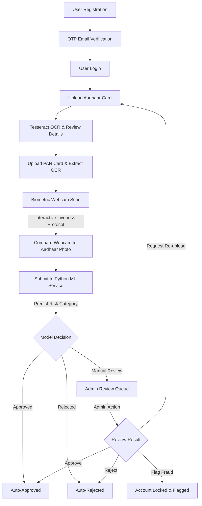

<h1 align="center">Veritas eKYC</h1>
<p align="center"><strong>A Full-Stack Onboarding and Identity Verification Simulation</strong></p>

<p align="center">
  
</p>

<p align="center">
  <a href="https://react.dev/"></a>
  <a href="https://expressjs.com/"></a>
  <a href="https://www.mongodb.com/atlas"></a>
  <a href="https://scikit-learn.org/"></a>
  <a href="https://cloudinary.com/"></a>
  
  
</p>

Veritas eKYC is a student-level full-stack web application designed to simulate a digital identity verification and user onboarding workflow. It provides user registration, email OTP verification, document upload (Aadhaar and PAN), optical character recognition (OCR) text extraction, client-side face comparison, and a basic machine learning service to categorize submission risk. It also features an admin panel for reviewing applications and managing statuses.

---

## 1. Project Title
**Veritas eKYC**: A full-stack web application designed to demonstrate and simulate a digital identity verification onboarding process.

---

## 2. Business Problem & Purpose
Banks and financial institutions must verify customer identity (KYC) before onboarding them to comply with regulatory standards and prevent fraud. Manual verification is a slow and resource-intensive process, requiring compliance officers to review physical or digital documents one by one. Incorrect, blurry, or fraudulent submissions increase operational workloads and cause onboarding delays. 

This project was built to streamline the KYC verification process. It combines optical character recognition (OCR), face verification, Cloudinary document storage, email OTP verification, and admin review workflows into a single platform, simulating a practical digital onboarding application.

---

## 3. Why This Project?
Traditional KYC workflows often involve multiple disconnected, manual verification steps. Reviewers must check documents, manually compare identity details, validate client signatures or photos, and maintain audit records. 

This application was developed as a learning project to demonstrate how modern web technologies can automate parts of the KYC process. The goal is not to replace existing enterprise banking systems, but to showcase a functional, end-to-end digital identity verification workflow. It serves as a demonstration of frontend development, backend API design, OCR text extraction, client-side biometrics, cloud asset management, database design, and machine learning integration working together in a single application.

---

## 4. Business Value
The project showcases the following practical benefits:
*   **Reduces Manual Input:** Automatically extracts data fields from documents via OCR, minimizing manual data entry errors.
*   **Faster Discrepancy Checks:** Helps reviewers identify name or date of birth mismatches between PAN and Aadhaar documents faster.
*   **Centralized Verification:** Combines document inspection, selfie verification, and audit trail retrieval in a single reviewer dashboard.
*   **Improved Efficiency:** Filters low-risk applicants and routes borderline cases to the manual review queue.
*   **Audit Readiness:** Maintains a detailed, immutable log of all verification and administrative actions.
*   **Guided Review Decisions:** Displays risk probability scores to assist administrators during the manual decision-making process.

---

## 5. Implemented Features
The application includes the following completed features:
*   **User Registration & Authentication:** Standard user signup and login with secure session handling.
*   **Email OTP Verification:** Validates user identity during signup using a 6-digit One-Time Password (OTP) sent via email (Nodemailer SMTP).
*   **Document Upload:** Allows users to upload scans of their Aadhaar and PAN cards, storing the files in Cloudinary.
*   **OCR Text Extraction:** Automatically extracts text from uploaded documents using Tesseract.js.
*   **Data Fields Parsing:** Automatically identifies and extracts Name, Date of Birth, Gender, Aadhaar Number, and PAN details from the recognized text.
*   **Face Verification:** Performs biometric comparison between the photo on the uploaded Aadhaar card and the user's live webcam selfie using client-side `face-api.js`.
*   **Liveness Detection:** Implements webcam movement checks (blinking, head turns, and smiling) to verify that a real user is present in front of the camera.
*   **Cloudinary Storage:** Securely stores uploaded documents and biometric selfies.
*   **MongoDB Atlas Database:** Persists application data including user profile details, KYC status, and audit logs.
*   **Admin Review Dashboard:** A dashboard for administrators to view applicant details, metrics, and logs.
*   **Admin Actions:** Admins can Approve, Reject, Request Re-upload, or Flag Fraud (which locks the account).
*   **Audit Logs:** Keeps a history of user and administrator actions (logins, uploads, status updates) with metadata like IP addresses and user agents.
*   **KYC Status Tracking:** Tracks applicant onboarding progress across steps (Pending, Under Review, Approved, Rejected).
*   **Random Forest Risk Classifier:** A Flask microservice running a Scikit-Learn Random Forest model that predicts a KYC recommendation (Approved, Manual Review, Rejected).

---

## 6. Complete Verification Workflow



---

## 7. System Architecture Diagram (ASCII)

```
+-----------------------------------------------------------------------------------------+
|                                  USER / CLIENT BROWSER                                  |
|                                                                                         |
|   +--------------------------+   +------------------------+   +---------------------+   |
|   |   React Client (Vite)    |-->| face-api.js (Local JS) |-->|   react-webcam      |   |
|   |  Interactive UI, Forms   |   | Liveness, Biometrics   |   |   Selfie Capture    |   |
|   +--------------------------+   +------------------------+   +---------------------+   |
+-----------------------------------------------|-----------------------------------------+
                                                | HTTP REST API Calls
                                                v
+-----------------------------------------------------------------------------------------+
|                                EXPRESS APPLICATION SERVER                               |
|                                                                                         |
|   +-----------------------+     +------------------------+     +--------------------+   |
|   |    Auth Middleware    |     |  Tesseract.js Engine   |     | Nodemailer (SMTP)  |   |
|   |  JWT Validation, Role |     |  OCR Data Extraction   |     | OTP Email Services |   |
|   +-----------------------+     +------------------------+     +--------------------+   |
|               |                             |                             |             |
|               v                             v                             v             |
|   +---------------------------------------------------------------------------------+   |
|   |                                  Controllers                                    |   |
|   | (Auth, Uploads, OCR, Verification, Admin Queue, Analytics, Dashboard)           |   |
|   +---------------------------------------------------------------------------------+   |
+------------------------|-------------------------|--------------------------|-----------+
                         |                         |                          |
       Mongoose Dialect  |                         | Multer File Streams      | Axios POST
                         v                         v                          v
+----------------------------------+     +-------------------+     +----------------------+
|             DATABASE             |     |   MEDIA HOSTING   |     |    PYTHON ML APPS    |
|                                  |     |                   |     |                      |
|       MongoDB Atlas Cloud        |     |  Cloudinary API   |     | Flask / Scikit-Learn |
|  User, Admin, Queue, AuditLog    |     | Aadhaar, PAN,     |     | Random Forest Model  |
|         collections              |     | Web Biometrics    |     | (Port: 5001)         |
+----------------------------------+     +-------------------+     +----------------------+
```

---

## 8. Tech Stack

The application uses a full-stack JavaScript architecture for the main web platform, combined with a Python microservice for machine learning classification:

| Component | Technology | Rationale / Use Case |
| :--- | :--- | :--- |
| **Frontend Core** | React 18.2, Vite | High-performance client build, reactive state rendering. |
| **Animation UI** | Framer Motion, GSAP, Lenis | Micro-interactions, timeline visual steps, premium aesthetics. |
| **Client Vision** | face-api.js | Neural networks (TinyYolov2, ResNet) running locally to save server compute. |
| **Biometric Input**| react-webcam | Captures stable webcam frame streams for liveness validation. |
| **Backend Framework**| Express 5.2 (Node.js) | Non-blocking API routing, middleware chaining, JSON parsing. |
| **OCR Engine** | Tesseract.js 7.0 | Server-side OCR reading Aadhaar/PAN image buffers directly. |
| **Email SMTP** | Nodemailer 9.0 | Delivers transactional OTP and verification link emails. |
| **Storage Engine** | Multer & Cloudinary v2 | Managed multipart file pipelines hosting document and selfie assets. |
| **Database** | MongoDB Atlas / Mongoose | Scalable Document store; dynamic schemas; custom query indexing. |
| **Machine Learning**| Python 3, Flask, Scikit-Learn | Random Forest Classifier evaluating verification data vectors. |

---

## 9. Folder Structure

```
Veritas-eKYC/
├── frontend/                     # React Single Page Application
│   ├── public/
│   │   └── models/               # Loaded weights for face-api.js
│   ├── src/
│   │   ├── components/           # Navbar, step trackers, layouts, route protectors
│   │   ├── pages/                # Uploads, processing pipeline, admin panels, dashboards
│   │   ├── App.jsx               # Client application routing configurations
│   │   ├── index.css             # Vanilla CSS design system variables & styles
│   │   └── main.jsx              # Client entry point
│   ├── package.json
│   └── vite.config.js
│
├── backend/                      # Node.js API Gateway & Business Logic
│   ├── config/                   # db.js, cloudinary.js, and multer pipelines
│   ├── controllers/              # Auth, uploads, OCR, verification, queues, analytics
│   ├── middleware/               # Auth protection and administrator access barriers
│   ├── models/                   # Schemas (User, Admin, AdminQueue, AuditLog, Device)
│   ├── routes/                   # Routing blueprints (auth, upload, ocr, analytics, queues)
│   ├── scripts/                  # seedAdmin.js to provision core administrators
│   ├── utils/                    # Audit logger and device fingerprint parser
│   ├── server.js                 # API server bootstrapper
│   └── package.json
│
├── ml/                           # Python Flask ML Service
│   ├── app.py                    # REST wrapper loading trained Random Forest model
│   ├── train_model.py            # Scikit-learn Random Forest model training script
│   ├── generate_data.py          # Synthetic dataset builder
│   ├── training.csv              # Synthetic user feature vectors for training
│   └── fraud_model.pkl           # Persisted binary classifier (joblib)
│
├── crop_cards.py                 # OpenCV contour card cropping script
└── process_images.py             # Background remover image processing script
```

---

## 10. Database Design

### Collection: `users`
Represents customer identity, verification steps, extracted OCR text, and biometrics.

| Field Name | Type | Description |
| :--- | :--- | :--- |
| `_id` | ObjectId | Primary Key |
| `fullName` | String | User's full name (required) |
| `email` | String | Unique user email (indexed) |
| `phone` | String | Contact number |
| `password` | String | BCrypt hashed password |
| `isVerified` | Boolean | Email OTP verification status flag |
| `otp` / `otpExpiry` | String / Date | 6-digit verification code and validity window |
| `aadhaarFile` / `panFile` | String | Cloudinary secure URLs of uploaded documents |
| `aadhaarName` / `panName` | String | Extracted names from OCR |
| `aadhaarNumber` / `panNumber` | String | Extracted unique identity strings |
| `faceImage` | String | Captured biometric selfie Cloudinary URL |
| `faceMatchScore` | Number | Calculated similarity confidence (0 - 100%) |
| `kycStatus` | String | Onboarding state: `pending`, `under_review`, `approved`, `rejected` |
| `isLocked` | Boolean | True if flagged as malicious by an administrator |

### Collection: `admins`
System administrator credentials.

| Field | Type | Use Case |
| :--- | :--- | :--- |
| `email` | String | Admin identity lookup (unique) |
| `password` | String | BCrypt hashed password |
| `accessCode` | String | Double-factor access code challenge |
| `role` | String | Default: `admin` |
| `isActive` | Boolean | Status control flag |

### Collection: `adminqueues`
Holds user application metadata submitted for manual evaluation.

| Field | Type | Description |
| :--- | :--- | :--- |
| `userId` | ObjectId | Reference to `User` collection |
| `faceMatchScore` | Number | Biometric comparison percentage |
| `ocrConfidence` | Number | Document extraction accuracy rating |
| `finalStatus` | String | Risk categorization recommendation from ML model |
| `approvedProbability`| Number | ML probability score for automatic approval |
| `rejectedProbability`| Number | ML probability score for automatic rejection |
| `adminNotes` | String | Evaluation log notes entered by administrator |
| `adminDecision` | String | Default: `PENDING`. Updates to `APPROVED`, `REJECTED`, etc. |

> **Concurrency Protection Index:**
> The `AdminQueue` schema enforces a unique composite partial index to prevent duplicate entries:
> ```js
> adminQueueSchema.index(
>   { userId: 1, email: 1 },
>   { 
>     unique: true, 
>     partialFilterExpression: { 
>       adminDecision: "PENDING"
>     } 
>   }
> );
> ```

### Collection: `auditlogs`
Immutable log tracing user transactions and identity transitions.

| Field | Type | Description |
| :--- | :--- | :--- |
| `userId` / `email` | ObjectId / String | Actor references |
| `eventType` | String | e.g. `LOGIN_SUCCESS`, `OCR_COMPLETION`, `ADMIN_DECISION` |
| `status` | String | Log outcome (`SUCCESS`, `FAILED`, `PENDING`) |
| `details` | String | Additional transaction metadata strings |
| `ipAddress` / `browser` / `os` | String | Session request parameters |
| `location` | String | Default local resolver output or "Chennai, IN" |

### Collection: `devices`
Tracks user browser/OS endpoints to identify session hijacking.

| Field | Type | Description |
| :--- | :--- | :--- |
| `userId` | ObjectId | Reference to `User` |
| `deviceType` / `browser` / `os` | String | Client browser fingerprints |
| `ipAddress` | String | Last seen IP address |
| `lastSeenAt` | Date | Last check-in timestamp |

---

## 11. Authentication Flow
Authentication uses standard JWT tokens:
1.  **Sign Up:** Creates a user in MongoDB. Generates a 6-digit OTP and OTP expiry time (10 min).
2.  **Verify OTP:** Activates the user by matching the entered code against the database. On success, signs and returns a JWT.
3.  **Log In:** Compares password hash using bcryptjs and returns a JWT.
4.  **Forgot/Reset Password:** Sends an email link containing a cryptographically secure token (`crypto.randomBytes`) that allows updating the password within 15 minutes.

---

## 12. OCR Processing Flow
OCR extracts identity details using Tesseract.js:
1.  **Image Upload:** Multer receives the image and pipes it directly to Cloudinary.
2.  **Text Recognition:** The Express backend runs Tesseract on the image.
3.  **Parsing:** Regular expressions extract values:
    *   *Aadhaar:* 12-digit number pattern `/\d{4}\s?\d{4}\s?\d{4}/`
    *   *PAN:* 10-character alphanumeric pattern `/[A-Z]{5}[0-9]{4}[A-Z]{1}/`
    *   *DOB:* Date format `/\d{2}\/\d{2}\/\d{4}/`
    *   *Gender:* Checks if text contains `"MALE"` or `"FEMALE"`
    *   *Name:* Extracts Name by cleaning lines and excluding keywords like "Government", "India", or "Aadhaar".
4.  **Database Save:** Saves parsed data fields to the user document.

---

## 13. Face Verification Flow
Face verification runs in the client browser using `face-api.js` to avoid overloading the server:
1.  **Liveness Verification:** Captures webcam stream and checks for the following landmarks:
    *   *Blink Detection:* Measures the Eye Aspect Ratio (EAR) based on vertical and horizontal eyelid distance:
        $$\text{EAR} = \frac{||\text{p2} - \text{p6}|| + ||\text{p3} - \text{p5}||}{2 \times ||\text{p1} - \text{p4}||}$$
        A blink registers when the average EAR falls below 0.29 and returns above 0.30.
    *   *Head Rotation:* Tracks horizontal nose placement relative to jaw boundaries:
        $$\text{NoseRatio} = \frac{\text{NoseX} - \text{Jaw}_0\text{X}}{\text{Jaw}_{16}\text{X} - \text{Jaw}_0\text{X}}$$
        A left turn registers when the ratio is > 0.60, and a right turn when it is < 0.40.
    *   *Smile Detection:* Checks face expression predictions (`expressions.happy > 0.35`).
2.  **Face Matching:** Loads the Aadhaar photo from the user profile, calculates face descriptors for both the Aadhaar image and the selfie, and determines the Euclidean distance:
    $$\text{Similarity \%} = \max\left(0, \text{round}\left((1 - \text{EuclideanDistance}) \times 100\right)\right)$$
3.  **Upload:** Uploads the captured selfie to Cloudinary and saves the similarity score.

---

## 14. Machine Learning Classification
The project uses a Random Forest classifier trained on a synthetic dataset. The model generates risk recommendations (Approved, Manual Review, Rejected) based on face match score, OCR confidence, PAN-Aadhaar matching, and liveness verification. Final approval decisions are still made by the administrator.

The classification model runs as a standalone Python microservice using Flask and Scikit-Learn. The model calculates the probability for each outcome class, and the highest probability determines the recommendation category returned to the backend queue.

---

## 14a. Admin Review Workflow
Applications that require manual evaluation are sent to the administrator review queue. Administrators log into a dedicated dashboard to perform the following operations:
1.  **Applicant Queue:** Displays a list of all pending applications, including applicant details, extraction confidences, and the ML risk recommendations.
2.  **Detailed Review Page:** Displays side-by-side matches of uploaded documents, extracted names, dates of birth, document numbers, and liveness status checks.
3.  **Admin Decisions:**
    *   *Approve:* Changes user verification status to `approved`.
    *   *Reject:* Rejects the application and logs the specific reason.
    *   *Request Re-upload:* Resets document flags to let the user upload again.
    *   *Flag Fraud / Lock:* Sets status to `rejected` and locks the account (`isLocked: true`).
4.  **Audit Logs:** Admins can view activity logs detailing each system transaction, actor, action status, IP address, and browser metadata.

---

## 15. API Endpoints

### User & Authentication Routes
| Method | Endpoint | Auth | Payload | Description |
| :--- | :--- | :--- | :--- | :--- |
| **POST** | `/api/auth/register` | None | `{fullName, email, phone, password}` | Registers user, generates OTP, sends email. |
| **POST** | `/api/auth/verify-otp` | None | `{email, otp}` | Validates OTP and returns JWT. |
| **POST** | `/api/auth/login` | None | `{email, password}` | User login endpoint returning JWT. |
| **POST** | `/api/auth/send-otp` | None | `{email}` | Regenerates and resends registration OTP. |
| **POST** | `/api/auth/forgot-password`| None | `{email}` | Generates reset token and sends link. |
| **POST** | `/api/auth/reset-password` | None | `{token, newPassword}` | Resets account password using token. |
| **GET** | `/api/auth/profile` | JWT | None | Fetches logged-in user profile details. |
| **POST** | `/api/auth/logout` | JWT | None | Logs out user and records audit event. |

### Document & Upload Routes
| Method | Endpoint | Auth | Payload | Description |
| :--- | :--- | :--- | :--- | :--- |
| **POST** | `/api/upload/aadhaar` | JWT | File (form-data: `aadhaar`) | Uploads Aadhaar card image to Cloudinary. |
| **POST** | `/api/upload/pan` | JWT | File (form-data: `pan`) | Uploads PAN card image to Cloudinary. |
| **POST** | `/api/ocr/aadhaar` | JWT | File (form-data: `aadhaar`) | Extracts text and saves Aadhaar details. |
| **POST** | `/api/ocr/pan` | JWT | File (form-data: `pan`) | Extracts text and saves PAN details. |

### Biometric & ML Verification Routes
| Method | Endpoint | Auth | Payload | Description |
| :--- | :--- | :--- | :--- | :--- |
| **POST** | `/api/verification/face` | JWT | File (`face`), `faceMatchScore` | Uploads selfie and saves face match score. |
| **POST** | `/api/verification/analyze`| JWT | `{faceMatch, panMatched, ...}` | Calls Flask ML service for status prediction. |
| **GET** | `/api/verification/status/:userId`| JWT | None | Fetches verification status for the user. |

### Dashboard & Metrics Routes
| Method | Endpoint | Auth | Payload | Description |
| :--- | :--- | :--- | :--- | :--- |
| **GET** | `/api/dashboard` | JWT | None | Compiles status, metrics, and recent notifications.|
| **GET** | `/api/notifications` | JWT | None | Returns user's dynamic notifications list. |
| **GET** | `/api/verification-timeline`| JWT | None | Compiles detailed onboarding step history. |
| **GET** | `/api/kyc/status` | JWT | None | Compiles status indicators for the tracker UI. |
| **GET** | `/api/kyc/process` | JWT | None | Evaluates flags for progress checklists. |
| **GET** | `/api/security/logs` | JWT | None | Returns audit logs and active user devices. |

### Administrative Queue & Analytics Routes
| Method | Endpoint | Auth | Payload | Description |
| :--- | :--- | :--- | :--- | :--- |
| **POST** | `/api/admin/login` | None | `{email, password, accessCode}` | Authenticates admin and returns admin JWT. |
| **POST** | `/api/admin/submit` | None | `{userId, email, faceMatchScore, ...}` | Submits user application to the review queue. |
| **GET** | `/api/admin/review-queue` | Admin JWT| None | Retrieves list of pending applications. |
| **GET** | `/api/admin/review-queue/:id` | Admin JWT| None | Retrieves full details for a review item. |
| **POST** | `/api/admin/approve/:id` | Admin JWT| `{adminNotes}` | Approves application and unlocks user. |
| **POST** | `/api/admin/reject/:id` | Admin JWT| `{adminNotes}` | Rejects application and logs reason. |
| **POST** | `/api/admin/reupload/:id` | Admin JWT| `{adminNotes}` | Requests document re-upload. |
| **POST** | `/api/admin/flag-fraud/:id`| Admin JWT| `{adminNotes}` | Flags application and locks user account. |
| **GET** | `/api/admin/analytics/metrics`| Admin JWT| None | Compiles metric cards for the dashboard. |
| **GET** | `/api/admin/analytics/weekly-verifications`| Admin JWT| None | Compiles verification throughput stats. |
| **GET** | `/api/admin/analytics/fraud-distribution`| Admin JWT| None | Compiles risk category percentages. |

---

## 16. Security Features
*   **Activity Logging:** Stores events (login attempts, document uploads, admin state transitions) in the `AuditLog` collection.
*   **Password Hashing:** Uses `bcryptjs` to hash passwords.
*   **Role-Based Security:** Checks that JWT tokens for admin paths contain `role: "admin"`.
*   **Queue Concurrency Lock:** Uses a partial unique index in MongoDB on `{ userId: 1, email: 1 }` for pending reviews, preventing duplicate concurrent entries.
*   **Account Lockout:** Locking an account (`isLocked: true`) prevents further actions or logins.

---

## 17. Cloudinary Storage Architecture
*   **Folder Separation:** Uploads are sorted dynamically based on the field name:
    *   `veritas-ekyc/aadhaar` for Aadhaar cards.
    *   `veritas-ekyc/pan` for PAN cards.
    *   `veritas-ekyc/face` for selfies.
*   **Filename Generation:** Selfies are saved as `face_[userId]_[timestamp]` to link them to the user.
*   **Format Constraints:** Standard image files (`jpg`, `jpeg`, `png`, `webp`) are enforced by Multer.

---

## 18. Deployment Architecture
*   **Frontend:** React client deployed on platforms like Vercel.
*   **Backend Server:** Node.js Express server hosted on Render, connecting to MongoDB Atlas.
*   **ML Service:** Flask API hosted on Render.
*   **Database & Media:** MongoDB Atlas database cluster and Cloudinary media cloud.

---

## 19. Installation Instructions

### Prerequisites
*   Node.js (v18 or higher)
*   Python (3.8 or higher)
*   MongoDB Atlas Account
*   Cloudinary Account

### Clone Codebase
```bash
git clone https://github.com/Ashikka-RB/Veritas.git
cd Veritas
```

### Backend Dependencies Installation
```bash
cd backend
npm install
```

### Frontend Dependencies Installation
```bash
cd ../frontend
npm install
```

### Python Virtual Environment & ML Dependencies
```bash
cd ../ml
python3 -m venv venv
source venv/bin/activate
pip install -r requirements.txt
```
*(If `requirements.txt` is missing, run: `pip install flask scikit-learn pandas joblib`)*

---

## 20. Environment Variables Required

### Backend Environment Configuration (`backend/.env`)
Create a `.env` file inside the `backend` folder:
```env
PORT=8000
MONGO_URI=mongodb+srv://<username>:<password>@cluster.mongodb.net/database
JWT_SECRET=your_secret_jwt_key
EMAIL_USER=your_gmail_address@gmail.com
EMAIL_PASS=your_gmail_app_password
CLOUDINARY_CLOUD_NAME=your_cloudinary_cloud_name
CLOUDINARY_API_KEY=your_cloudinary_api_key
CLOUDINARY_API_SECRET=your_cloudinary_api_secret
```

### Frontend Environment Configuration (`frontend/.env`)
Create a `.env` file inside the `frontend` folder:
```env
VITE_API_URL=http://localhost:8000
```

---

## 21. Local Development Setup

### 1. Seed the Database Admin Account
Initialize the admin collection in MongoDB with a default user:
```bash
cd backend
npm run seed-admin
```
*Creates administrator account:* `admin@veritas.com` | *Password:* `Admin@123` | *Access Code:* `123456`.

### 2. Train the Python Fraud Classifier
Generate the synthetic dataset and train the Random Forest model:
```bash
cd ../ml
source venv/bin/activate
python generate_data.py
python train_model.py
```
*Outputs:* `training.csv` and `fraud_model.pkl`.

### 3. Start services
Start the services in separate terminal windows:

*   **Start Flask service:**
    ```bash
    cd ml
    source venv/bin/activate
    python app.py
    ```
    *(Runs on `http://127.0.0.1:5001`)*

*   **Start Express API service:**
    ```bash
    cd backend
    npm run dev
    ```
    *(Runs on `http://localhost:8000`)*

*   **Start Frontend dev server:**
    ```bash
    cd frontend
    npm run dev
    ```
    *(Runs on `http://localhost:5173`)*

---

## 22. Conclusion
Veritas eKYC is a practical demonstration of integrating different components of a modern web stack: REST APIs, client-side biometrics, cloud-based storage, and simple machine learning models. 

By building this project, I gained experience in structured full-stack architectures, handling asynchronous file upload streams, running browser-based model inference, and implementing audit security protocols. It serves as an honest, functional portfolio project demonstrating the fundamentals of software engineering, system integration, and security controls.
